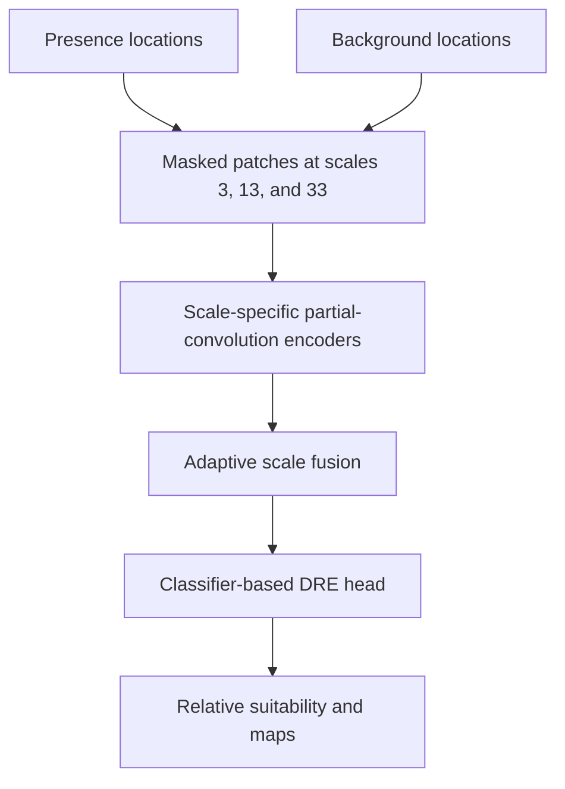

# Deep Learning for Disease Distribution Modelling

### Mask-aware multiscale convolutional density-ratio estimation for global dengue suitability

This repository contains the code accompanying a study of how **spatial environmental context** and **spatial scale** structure the global suitability of dengue virus.

Most ecological niche models represent a location using covariate values from one pixel. That representation ignores the surrounding configuration of climate, vegetation, water availability, human settlement, and vector habitat. This project instead represents each location using environmental raster patches and learns relative dengue suitability from local, neighbourhood, and broader landscape context.

The main contribution is a **multiscale CNN-DRE**: a mask-aware convolutional neural network coupled to a classifier-based density-ratio estimation head. It is designed for incomplete, spatially biased presence-only occurrence records and uses background locations to represent the environmental conditions available across the study area.

> **Interpretation:** The model estimates relative environmental suitability. Its output is not a calibrated probability of infection, case incidence, or an operational public-health forecast.

## Main findings

On a spatially disjoint held-out test set, the multiscale CNN-DRE achieved:

| Test metric or result                                      |          Reported value |
| ---------------------------------------------------------- | ----------------------: |
| ROC AUC                                                    |               **0.976** |
| Continuous Boyce Index                                     |               **0.971** |
| Additional suitable area relative to point-based baselines |               **6–18%** |
| Most influential spatial context                           | **Neighbourhood scale** |

Learned scale weights and single-scale ablations showed that neighbourhood context contributed most strongly, while local and broader-scale information provided complementary signals. Relative to point-based models, the multiscale model identified additional environmentally suitable areas across South Asia, Southeast Asia, and South America, encompassing tens of millions of residents.

## Research questions

This project asks:

1. Does spatial representation learning improve dengue ecological niche modelling relative to point-based methods?
2. Is dengue suitability better represented as a multiscale environmental signal than as a focal-pixel covariate response?
3. Which spatial scales contribute most strongly to model predictions?
4. How does classifier-based DRE compare with alternative density-ratio estimators?

## Modelling framework

### Presence-background density-ratio estimation

Reported dengue locations are treated as presences, while background locations sample the environmental conditions available across the wider study area.

The target is the relative density ratio:

$$
r(\mathbf{x}) =
\frac{p(\mathbf{x}\mid\text{presence})}
{p(\mathbf{x}\mid\text{background})},
$$

where $\mathbf{x}$ is either a pointwise covariate vector or a multichannel environmental patch. Larger values indicate environments that are more strongly represented around reported occurrences than in the sampled background.

Background points are not interpreted as confirmed absences.

The repository includes experiments with:

* Kullback-Leibler Importance Estimation Procedure (**KLIEP**)
* Classifier-based density-ratio estimation
* Kernel Least-Squares Importance Fitting (**KuLSIF**)
* Unconstrained Least-Squares Importance Fitting (**uLSIF**)

The classifier-based formulation is used in the CNN-DRE models.

### Mask-aware spatial representation

For each presence or background location, the preprocessing pipeline extracts aligned environmental patches and an observation mask:

* `X.npy` stores raster values after missing cells are median-imputed.
* `M.npy` stores the corresponding mask, with `1` for observed cells and `0` for missing or padded cells.

The CNN uses partial-convolution and mask-aware pooling operations so that imputed cells are not treated as genuine environmental observations.

### Spatial scales

The scale experiments compare:

| Model              | Spatial input                              |
| ------------------ | ------------------------------------------ |
| Point baselines    | Covariates extracted at the focal location |
| Scale 3 CNN-DRE    | 3 × 3 raster patches                       |
| Scale 13 CNN-DRE   | 13 × 13 raster patches                     |
| Scale 33 CNN-DRE   | 33 × 33 raster patches                     |
| Multiscale CNN-DRE | Joint 3 × 3, 13 × 13, and 33 × 33 context  |

The multiscale implementation receives patches of size 33 × 33, 13 × 13 and 3 × 3. Each scale has a matching mask-aware encoder.

A learned gating network produces sample-specific scale weights and fuses the scale representations before density-ratio estimation.

### Training and evaluation

Evaluation uses spatially disjoint data rather than a random point split:

* Spherical k-means defines spatial clusters.
* A fixed subset of clusters is reserved for external testing.
* The remaining clusters are assigned to spatial cross-validation folds.
* A distance buffer around test presences can be excluded from cross-validation.
* The external test set is used only for final evaluation.

Performance is assessed primarily using ROC AUC and the Continuous Boyce Index.

## Model overview



## Benchmarks and ablations

The proposed model is evaluated against point-based ecological niche modelling baselines:

* **Random Forest**
* **Maximum Entropy (MaxEnt)**
* **MLP-DRE**, a feedforward classifier-based density-ratio estimator using pointwise covariates

The repository also contains:

* Alternative DRE formulations
* Fixed-scale CNN-DRE models at scales 3, 13, and 33
* The adaptive multiscale CNN-DRE
* Learned scale-weight extraction for interpretation
* Out-of-fold and held-out test prediction pipelines

## Repository structure

```text
Deep-Learning-for-Disease-Distribution-Modelling/
├── README.md
├── notebooks/
│   ├── baselines/
│   │   ├── random_forest.py
│   │   ├── maxent.py
│   │   └── mlp_dre.py
│   ├── dre_approaches/
│   │   ├── 01_kliep.ipynb
│   │   ├── 02_classifier_dre.ipynb
│   │   ├── 03_kulsif.ipynb
│   │   └── 04_ulsif.ipynb
│   └── scale_based_models/
│       ├── 01_multiscale_cnn_dre.py
│       ├── 02_scale_3.py
│       ├── 03_scale_13.py
│       └── 04_scale_33.py
├── preprocessing/
│   ├── point_extraction/
│   │   ├── preprocess_rasters.py
│   │   └── extract_points.py
│   ├── extract_patches.py
│   ├── spatial_cross_validation.py
│   └── README.md
├── data
└── outputs/
    ├── figures/
    ├── suitability_maps
```

## Reproducing the workflow

### 1. Create an environment

Python 3.10 or later is recommended.

```bash
python -m venv .venv
source .venv/bin/activate  # Windows: .venv\Scripts\activate
python -m pip install --upgrade pip
```

Install the dependencies for the component being used:

```bash
pip install -r preprocessing/requirements.txt
pip install -r notebooks/scale_based_models/requirements.txt
```

The baseline and DRE folders contain their own dependency files.

### 2. Prepare rasters and spatial splits

The preprocessing package normalizes aligned rasters, creates the spatial train-test design, and extracts point or patch representations.

See [`preprocessing/README.md`](preprocessing/README.md) for complete commands.

A typical processing order is:

1. Align all raster covariates to a common CRS, transform, extent, and resolution.
2. Normalize each raster using its median and interquartile range.
3. Construct the spatial cross-validation and external-test split.
4. Extract point features for Random Forest, MaxEnt, MLP-DRE, and the DRE comparison.
5. Extract scale-specific patches and masks for the CNN-DRE experiments.

### 3. Train the scale-based models

Run the multiscale model from the repository root:

```bash
python notebooks/scale_based_models/01_multiscale_cnn_dre.py \
  --cv-dir data/processed/patches/cv/scale_33 \
  --test-dir data/processed/patches/test/scale_33 \
  --output-dir outputs/models/multiscale_cnn_dre
```

Run the single-scale controls using their matching data directories:

```bash
python notebooks/scale_based_models/02_scale_3.py \
  --cv-dir data/processed/patches/cv/scale_3 \
  --test-dir data/processed/patches/test/scale_3
```

```bash
python notebooks/scale_based_models/03_scale_13.py \
  --cv-dir data/processed/patches/cv/scale_13 \
  --test-dir data/processed/patches/test/scale_13
```

```bash
python notebooks/scale_based_models/04_scale_33.py \
  --cv-dir data/processed/patches/cv/scale_33 \
  --test-dir data/processed/patches/test/scale_33
```

Each run saves fold checkpoints, out-of-fold scores, validation AUC values, ensemble weights, and external-test predictions under its output directory.

### 4. Run the DRE comparison and point baselines

The DRE notebooks contain multiple experiment sections. Run only the section corresponding to the intended estimator and experiment configuration.

Random Forest, MaxEnt, and MLP-DRE use point-level features extracted from the same spatial cross-validation and external-test split used for the CNN experiments. This is necessary for a valid representation-level comparison.

### 5. Produce suitability maps

Use the selected model to predict across the aligned raster domain and save the resulting relative-suitability surfaces.

## Expected data contracts

### Point tables

| Column       | Meaning                                                      |
| ------------ | ------------------------------------------------------------ |
| `Longitude`  | Point longitude                                              |
| `Latitude`   | Point latitude                                               |
| `label`      | Presence/background or binary 1/0 label                      |
| `fold`       | Spatial cross-validation fold; absent or NaN for test points |
| `cluster_id` | Spherical spatial-cluster identifier                         |

Background labels indicate sampled environmental availability, not confirmed disease absence.

### Patch datasets

Each scale directory contains:

| File              | Shape or purpose                           |
| ----------------- | ------------------------------------------ |
| `X.npy`           | `[N, C, H, W]` environmental patches       |
| `M.npy`           | `[N, C, H, W]` observation masks           |
| `y.npy`           | `[N]` presence/background labels           |
| `fold.npy`        | `[N]` spatial fold assignments for CV data |
| `cluster.npy`     | `[N]` spatial cluster identifiers          |
| `patch_names.npy` | `[C]` raster-channel names                 |
| `meta.parquet`    | Original point metadata for traceability   |

Raster covariates used together must share the same CRS, affine transform, extent, resolution, width, and height.

## Reproducibility principles

* Keep the spatial split identical across all model comparisons.
* Do not tune models or thresholds using the external test set.
* Preserve raw data and write derived artifacts under `data/processed/`.
* Record random seeds, raster versions, patch sizes, covariate sets, and model hyperparameters.
* Keep observation masks paired with their patch arrays.
* Report both aggregate test metrics and spatially stratified results.
* Treat mapped outputs as relative environmental suitability rather than observed transmission or future incidence.


## Project scope

The repository name reflects a broader programme on deep learning for disease distribution modelling. The results documented here concern the multiscale CNN-DRE dengue study.

Bayesian neural networks and variational autoencoders are potential extensions, but they are not part of the reported benchmark results.

## Citation

If you use this code, cite the associated paper. The formal citation and DOI will be added when available.

